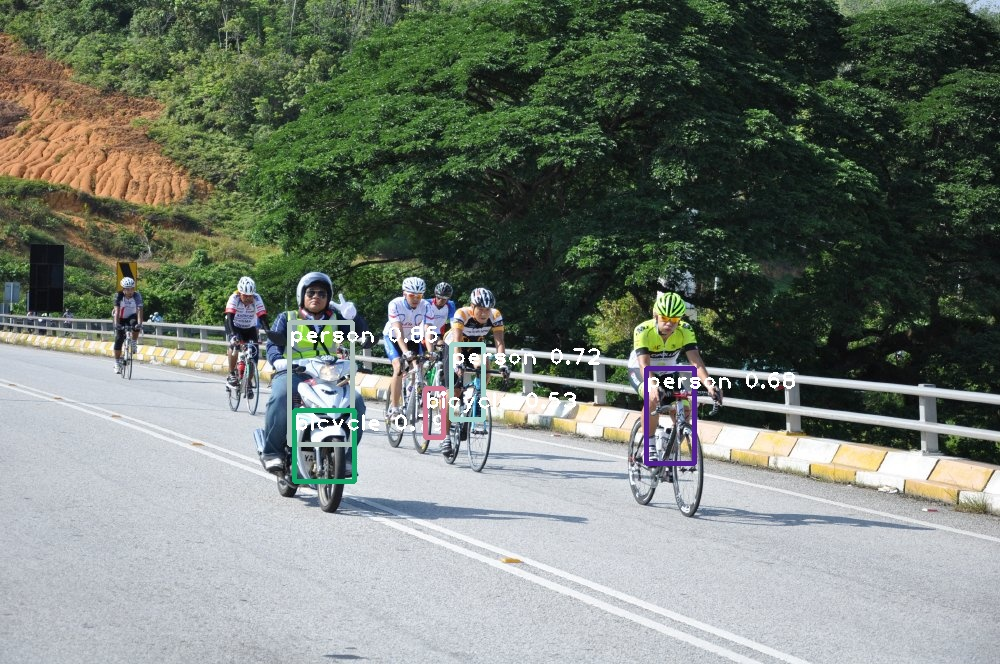
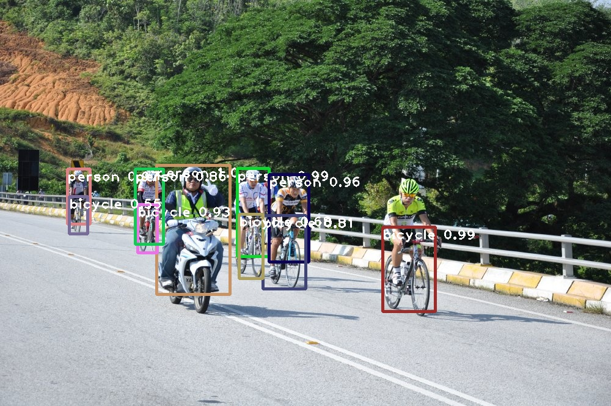
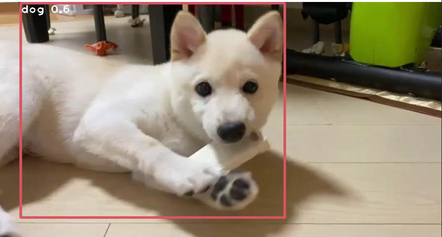

# Introduction

You Only Look Once (YOLO) which have been developed in 2016 bring fundamental changes in object detection since both speed and accuracy are highly maintained than the others traditional models where single convolution neural network in a single stage model that takes the localization and detection simultaneously are adopted.

In this project, I have implemenment the yolo-detection model on both image and video ih the trained class provided in the coco.names files. YOLO v3-320 to YOLOv3-tiny are provided as the source of model which can be replaced and the results of both model can be compared. Python OpenCV and numpy are used in the project.

# Results

### Image

Original Imgae

Result of YOLOv3-tiny

Result of YOLO v3-320:

YOLOv3 can successfully detect multiple objects in an image at the same time with loaction and size of boundary to surround the object. Moreover, the object classes as well as the probability are given in the image.

Compare to the YOLOv3-tiny and YOLOv3-320 resutls, we can observed that YOLOv3-320 performed much better where more objects are correctly identified. There are some persons and bicycle are missed in the YOLOv3-tiny model. Moreover, for the classified object, the confidence value of the classes is also higher, as well as the location of the bounding box is more accurate, indicating that the classification of the YOLOv3-320 are much better where the weighting of classes is trained better. However, although Coco dataset consist of motorcycle, the
motorcycle is mis-recognized as bicycle in the above image which is a similar class.

### Video

A video with a dog is playing with his toys is inputted in the model.The dog is moving continuously where the whole body are sometime not included in the frames, and there will be some extra object added to the frame. From the above results, we can see that YOLOv3-tiny are not perform well on the input video. For the
same frame, YOLOv3-tiny sometimes cannot recognized the correct classes where the probability is less than 0.5 confidence value. Even for the detected label during the video, the confidence value of the results is also much smaller than the YOLOv3-320. YOLOv3-320 nearly can capture every frame of the dogs moving,
and even when there is new object exist, the model can quickly detect and adding label to its with very low latency while YOLOv3-tiny do not.

# Conclusion

YOLOv3-320 model are generally perform better on both image and video with very higher accuracy and slow latency in the detection.
